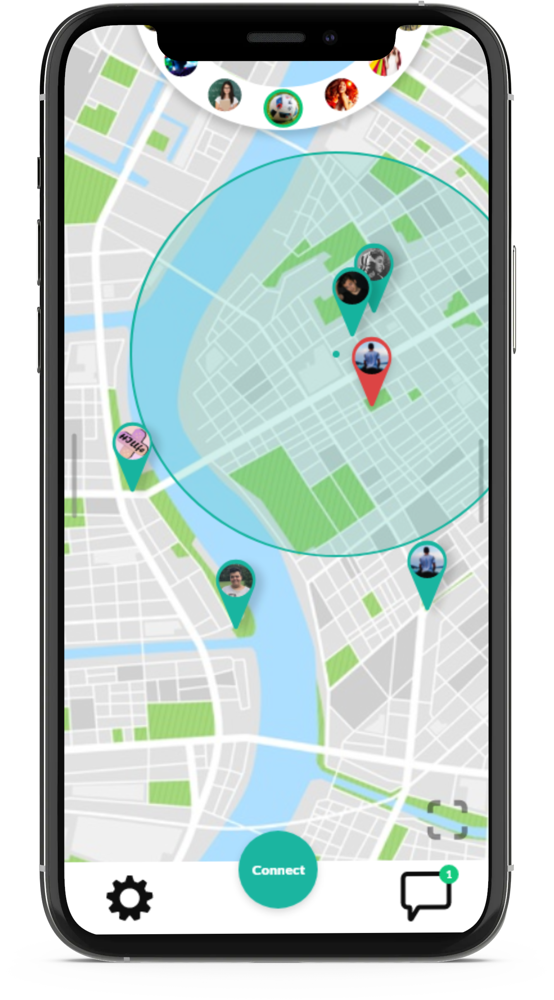

<!-- PROJECT LOGO -->
# Connect
entwickelt im Zuge des ITP-Unterrichts  
**Team**: Jan Donnerbauer, Tristan Hill, Simon Ibrahim, Tobias Rafetseder, Ben Weinzierl

<!-- TABLE OF CONTENTS -->

## Inhalt

* [Beschreibung](#toc_2)
* [Technologien](#toc_3)
* [Links](#toc_4)

<!-- ABOUT THE PROJECT -->

## Beschreibung

Connect ist eine App, die Leute schnell und einfach zusammenbringt. Anhand von bestimmten Aktivitäten (Sport, Freizeit, Hobbies, …) kann man Menschen in seiner Nähe finden, mit denen man etwas unternehmen kann. 
Jetzt kann man ganz leicht einen Mitspieler für die nächste Golfpartie finden oder sich gegenseitig beim Mittagessen Gesellschaft leisten. 

Connect ist keine Dating-App. Ihr könnt euch ohne Druck und Erwartungen treffen und einfach eine gute Zeit miteinander verbringen. 

Connect verbindet Leute, die etwas gemeinsam unternehmen wollen. Wir glauben, dass jeder Mensch das Recht auf Gesellschaft hat. Darum verzichten wir auf oberflächliche Auswahlmethoden wie Profilbilder oder ähnliches und setzten auf das Zufallsprinzip. 
Damit das auch funktioniert, wünschen wir uns von unseren Usern eine offene und tolerante Einstellung.

### Technologien
Es wird eine Client-Server-Architektur entwickelt. Der Server wird mithilfe des Java Framework Quarkus erstellt. Die Kommunikation zwischen Server und Client wird mit dem REST-WebService gelöst. Die Benutzerverwaltung, Authentifizierung und Rechteverwaltung wird mit dem Open Source Identity and Access Management Tool Keycloak gelöst. 

Verwendete Technologien

- Quarkus
- Docker
- MySQL
- REST
- Angular
- Ionic
- Keycloak

<!-- GETTING STARTED -->

<!-- USAGE EXAMPLES -->

<!-- ROADMAP -->

<!-- CONTRIBUTING -->

<!-- LICENSE -->

<!-- CONTACT -->

<!-- ACKNOWLEDGEMENTS -->
## Links
* [Quarkus](https://quarkus.io/)
* [Angular](https://angular.io/docs)
* [Ionic - Angular Framework](https://ionicframework.com/docs/angular/your-first-app)
* [Keycloak](https://www.keycloak.org/)
